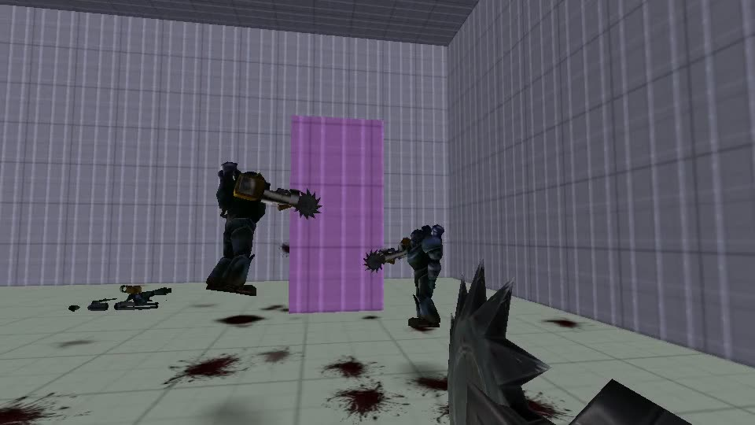
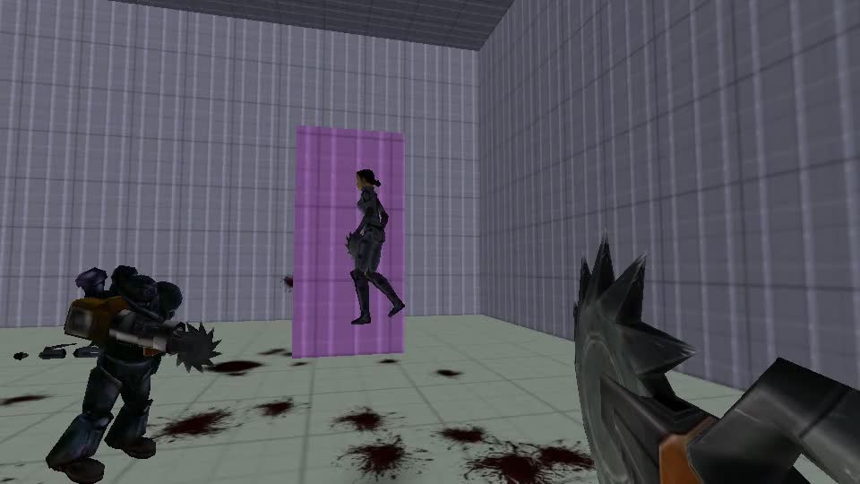
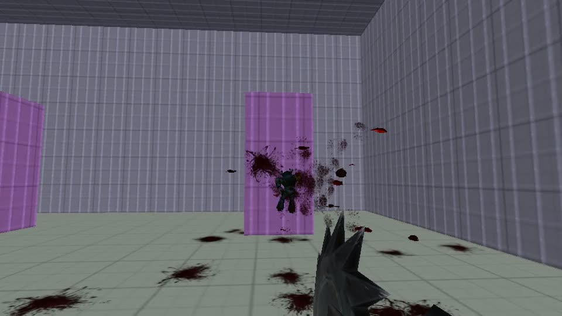
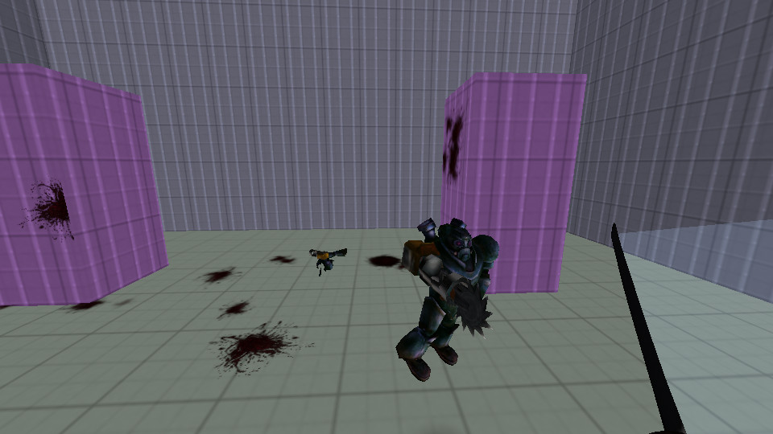
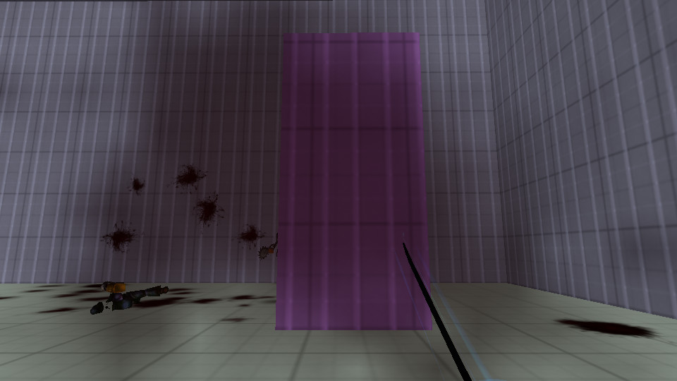

# STRAFE 64 — engine build

A clean, self-contained tree for the C/ioquake3 build of STRAFE 64: the
ioquake3 engine with the STRAFE 64 movement/race mod compiled in, plus the
procedural course generator and design docs.

> This is the native-engine line of the project. A separate Godot
> reimplementation lives at `~/strafe64` and is unrelated to this tree.

## Gameplay

A melee/slow-mo bullet-time arena: a katana, deflectable projectiles, parries,
and the **LATTICE** mode — damaging speed-trail walls (the magenta slabs) that
the third "player" weaves across the floor as a last-pilot-alive hazard. Time
slows when you're still and surges when you swing.



| | |
|---|---|
|  |  |
|  |  |

A 5-second bullet-time hero clip lives at
[`docs/screenshots/bullet-time.mp4`](docs/screenshots/bullet-time.mp4).

## Layout

```
engine/            ioquake3 engine source + the STRAFE 64 mod
                   (code/game = qagame, code/cgame = cgame, code/q3_ui = ui;
                    cmake/basegame.cmake wires the mod sources into the build)
tools/strafegen/   procedural course generator — writes playable IBSP v46
                   .bsp files directly (no q3map). Includes a prebuilt arm64
                   `bspc` AAS compiler and the strafe64.cfg / psx.cfg presets.
docs/              ART_DIRECTION, MOVEMENT, ROADMAP, VISUALS, PLAYTEST,
                   HUMAN_PLAYTEST
scripts/           build.sh, run.sh
COPYING.txt        GPLv2 (id Software / ioquake3)
```

## Build

Requires CMake ≥ 3.25, Ninja, and a C toolchain (Apple Silicon / arm64).

```sh
./scripts/build.sh          # configure + build -> engine/build/Release
./scripts/build.sh clean    # wipe and rebuild
```

This produces `engine/build/Release/`: `ioquake3.app`, `ioq3ded`, and the
modded `baseq3/{qagame,cgame,ui}.dylib`.

## Run

The game runs on the **OpenArena 0.8.8** free asset set (third-party,
~455 MB). It's bundled in-tree at `assets/openarena/` (gitignored — not ours
to version), and `run.sh` uses it by default. Override with the `OA` env var:

```sh
./scripts/run.sh            # windowed, main menu
./scripts/run.sh -f         # fullscreen
./scripts/run.sh -b 4       # 4-bot match
./scripts/run.sh -p         # PSX low-fi preset
./scripts/run.sh -daily     # today's surf circuit + daily mutator
OA=/path/to/openarena ./scripts/run.sh
```

`run.sh` deploys the three modded dylibs into `baseoa/` together (they share
networked headers — never deploy one alone) and re-signs them for Apple
Silicon dlopen.

## Generate courses

```sh
cd tools/strafegen
python3 strafegen.py 1337              # -> generated/strafe64_1337.bsp
python3 strafegen.py --daily --pk3     # today's tower, shareable worldwide
python3 strafegen.py 1337 --arena --pk3
```

See `tools/strafegen/README.md` for the full generator reference.

## Notes

- `engine/build/`, `tools/strafegen/generated/`, `__pycache__/`, and the two
  source repos' `.git/` histories were intentionally excluded — everything
  here is source or a checked-in tool binary, and is rebuildable/regenerable.
- Canonical mod source for this tree was taken from the `ioquake3` build tree
  (what actually compiles and runs), not the id GPL `Quake-III-Arena` dump.
