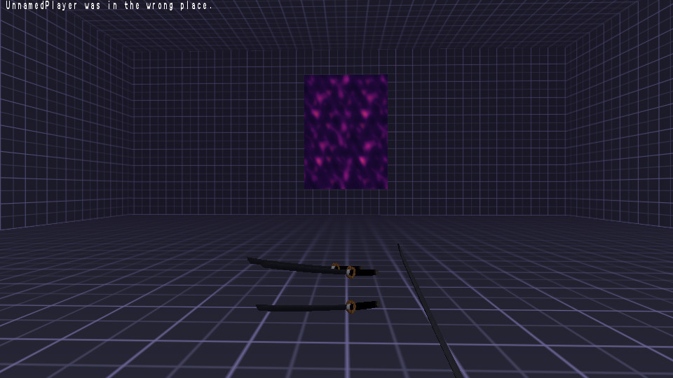
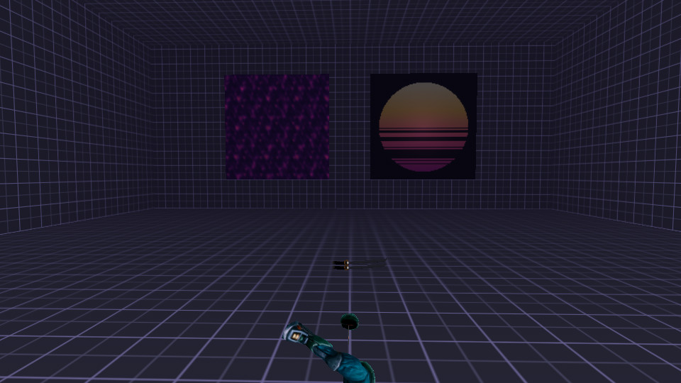
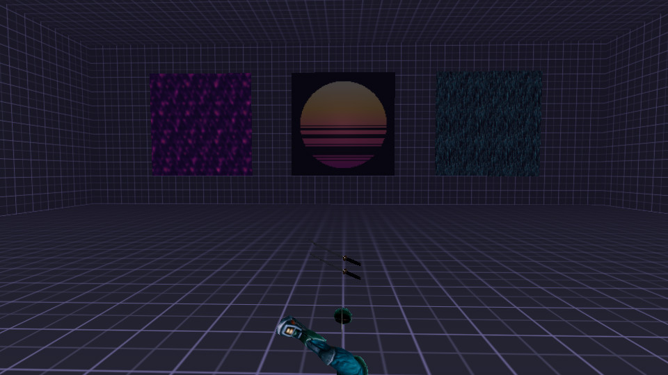

# STRAFE 64 — Shader Library

A growing gallery of visually striking shaders found in the wild (Shadertoy,
GitHub, forums) **re-created with idTech3 shader-script techniques** and bent to
STRAFE 64's visual direction: synthwave / neon / void / dissolving-world /
audio-reactive.

idTech3 can't run arbitrary GLSL per surface, so we port the **look**, not the
code — bake what the fragment shader computes per-pixel into a procedural texture,
then animate it with shader stages (`tcMod scroll/turb/rotate/stretch`,
`deformVertexes`, `rgbGen/alphaGen wave`, and the audio genfuncs
`bass`/`mid`/`high`/`level`). Where it fits, at least one stage rides the music.

## Build & view

```sh
cd tools/strafegen/shaderlib
python3 gallery.py            # generates textures + a loose shader + a gallery map, deploys to baseoa
```

Then in-engine (a sealed dark neon-grid room with one glowing panel per shader):

```
/map shaderlib_gallery
```

Tip: play a bass-heavy track (`/music music/liquid_calibre_even-if.mp3`) — the
audio-reactive panels pump with the kick. The generated assets live under the
git-ignored `assets/openarena/baseoa/` (run `gallery.py` to regenerate); only the
generator, this doc, and the preview thumbnails are versioned.

---

## Shaders

### 01 · Neon Plasma Flow — `shaderlib/plasma`



Flowing synthwave plasma: deep-indigo void shot through with magenta/pink/cyan
neon veins that churn and flare on the kick drum.

- **Ports:** Shadertoy — [*Neon Plasma Storm* (4scGDH)](https://www.shadertoy.com/view/4scGDH) and the classic [*Plasma Waves* (ltXczj)](https://www.shadertoy.com/view/ltXczj) family.
- **Technique:** a seamless, tileable **sum-of-directional-sines** plasma baked
  through a mostly-dark synthwave palette (so the neon veins read against the
  void), then **three additive stages** scroll + `tcMod turb` it at different
  scales for the churn. The third stage's brightness is `rgbGen wave bass`, so it
  pumps with the music; the gl2 bloom makes the bright veins glow.

### 02 · Synthwave Sun — `shaderlib/sun`



The signature retro sunset disc — a white-hot/amber crown fading down to magenta,
cut by horizontal scanline bars that widen toward the base, wrapped in a soft glow
that swells and pumps on the kick.

- **Ports:** Shadertoy — [*Synthwave Shader [VIP2017]* (MslfRn)](https://www.shadertoy.com/view/MslfRn) and [*another synthwave sunset thing* (tsScRK)](https://www.shadertoy.com/view/tsScRK).
- **Technique:** the sun disc (vertical white→amber→magenta gradient with widening
  scanline gaps on the lower half) and a soft radial halo are baked on black for
  additive blend. `rgbGen wave bass` swells the halo and pumps the disc on the
  kick. This is a **single-image** shader, so it uses the gallery's `%FIT%` token
  → a per-panel `tcMod transform` that maps the texture exactly once onto the panel
  (no tiling), unlike the seamless plasma which tiles.

> **Gallery note:** panels are square so single-image discs stay round, and each
> `fit` shader gets a `tcMod transform` computed for its panel (`_fit_tcmod`). To
> reuse a `fit` shader on a real map surface, size/scale the surface to taste —
> the transform is gallery-panel-specific.

### 03 · Digital Rain — `shaderlib/rain`


*(right panel — plasma and sun shown for scale)*

The dissolving digital world: columns of falling data — bright white-cyan heads
trailing into blue — raining harder on the hats.

- **Ports:** Shadertoy — the classic [Matrix digital-rain family (e.g. ldjBW1)](https://www.shadertoy.com/view/ldjBW1).
- **Technique:** seamless column streaks baked into a texture (white-cyan heads,
  fading cyan tails, per-cell glyph flicker, vertically wrapped so it tiles), then
  two additive layers scroll downward at different scales for parallax. The near
  layer's brightness is `rgbGen wave high`, so hats/snares burst the rain. Seamless,
  so it tiles across the panel (no fit).

<!-- next entries appended here by the shader loop -->
